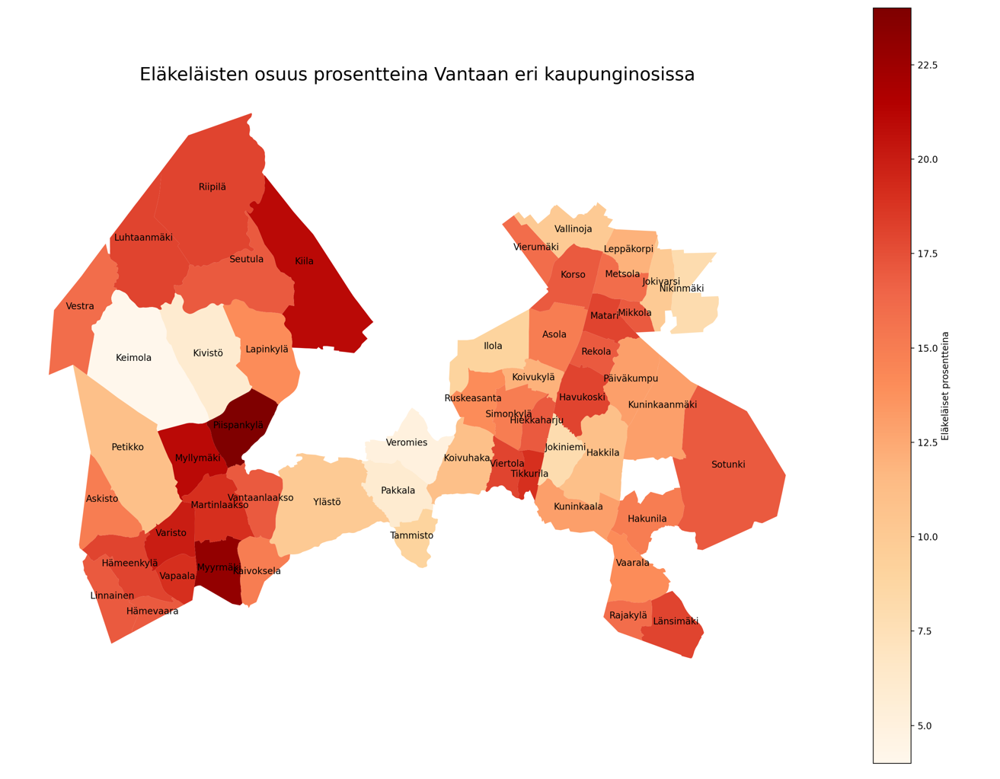

# Vantaa-Data_to_Maps
Hyödyntäen HRI:n (https://hri.fi/data/dataset/vantaan-v-est) avointa dataa Vantaan väestöstä .xlsx muodossa,
muokkaan datan sopivaan muotoon käytettäväksi Vantaan kaupungin avoimessa paikkatietojärjestelmässä (GSI, WFS) (https://gis.vantaa.fi/geoserver/wfs)

Tällä hetkellä ohjelma tukee kahden eri datasarjan havainnollistamista:
- kartan tekemistä eläkeläisten osuuksista Vantaan eri kaupunginosista
- väestönmuutosta Vantaan eri kaupunginosissa

Ohjelmassa on tuettuna suomen lisäksi myös englannin kieli.

The program is also available in English!



# Asennus

Tarvitset [Python 3:n](https://www.python.org/downloads/)

Asenna tältä GitHub-sivulta koodi ja käytä terminaalissa komentoa

```
pip install -r requirements.txt
```
**Huomioi**, että ohjelmani käyttää Geopandas-kirjastoa, joka tarvitsee Fiona-kirjaston toimiakseen.
Fiona **ei** tarjoa Windowsille binääritiedostoja Pythonin terminaalista asennettuna. Suosittelen asentamaan [miniconda-terminaalin](https://docs.conda.io/en/latest/miniconda.html),
joka asentaa myös binääritiedostot.

Requirements.txt:n asennuksen jälkeen voit ajaa Python-tiedoston:

```
python main.py
```
